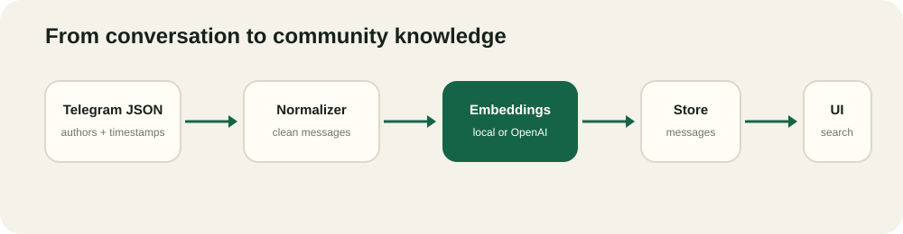
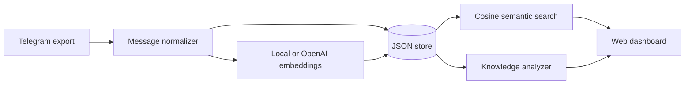

# KioNote MVP v0.1

KioNote converts community conversations into searchable knowledge. Import a Telegram JSON export and it produces semantic search, a discussion digest, frequently answered questions, topic articles, and expert discovery.



## Why this MVP

Community answers are useful but disappear into chat history. KioNote makes that history browsable and reusable without becoming another chatbot. The v0.1 workflow is deliberately small:

1. Upload a Telegram Desktop `result.json` export.
2. Normalize authors, timestamps, replies, and rich text.
3. Create embeddings and persist the messages.
4. Search discussions by meaning.
5. Generate an FAQ, topic digest, articles, and contributor signals.

The app uses deterministic local embeddings by default, so the demo works without credentials. Set `OPENAI_API_KEY` to use `text-embedding-3-small` embeddings instead.

## Quick start

Requires Node.js 20 or newer.

```bash
npm start
```

Open `http://localhost:3000`, then upload [`sample-data/telegram-export.json`](sample-data/telegram-export.json).

```bash
npm test
docker compose up --build
```

## API

| Method | Route | Purpose |
| --- | --- | --- |
| `POST` | `/api/import/telegram` | Import and index a Telegram export |
| `GET` | `/api/search?q=...` | Search community messages semantically |
| `GET` | `/api/dashboard` | Fetch topics, FAQs, articles, and experts |
| `GET` | `/api/community/:id` | Fetch generated knowledge for one community |

## Architecture



The JSON store keeps the MVP immediately runnable. The storage module is intentionally isolated so PostgreSQL with pgvector can replace it without changing the import, analysis, API, or UI layers.

## Roadmap

- PostgreSQL and pgvector storage adapter
- Model-generated synthesis with citations back to source messages
- Discord and Slack importers
- Topic clustering and scheduled daily/weekly digests
- Moderation controls, redaction, and data-retention settings
- Community workspaces and public knowledge pages

## Privacy

Chat exports may contain private or sensitive data. Only import conversations you are authorized to process. The default setup stores data locally in `data/store.json`.

## License

MIT
